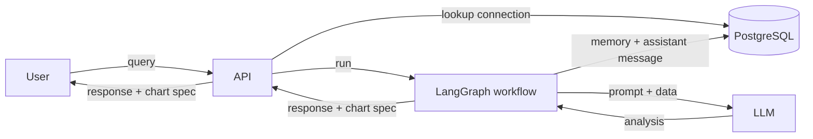
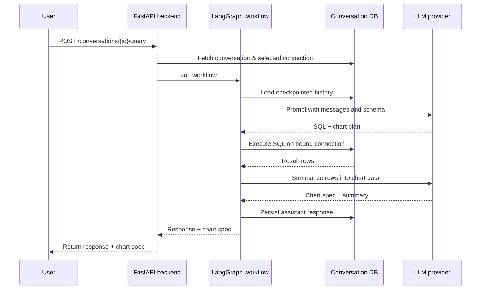
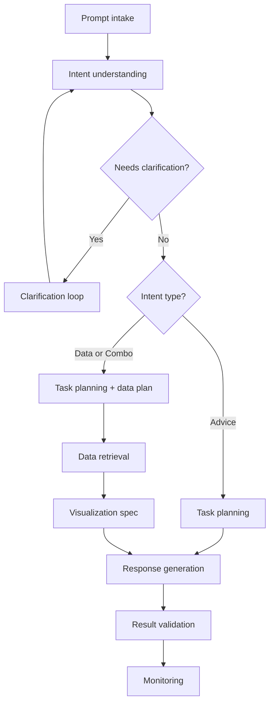
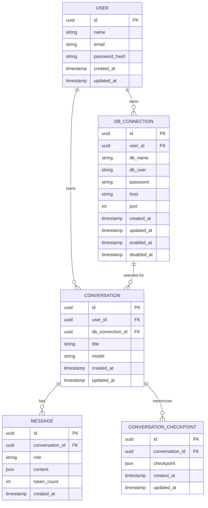

# llm-data-analyst

Full‑stack demo of an LLM‑powered data analysis assistant. The repository contains a
React + Vite front end and a FastAPI backend.

## Features

- User registration and login with JWT stored in HTTP‑only cookies
- Manage and enable/disable database connections
- Create conversations and retrieve full message history
- Toggleable sidebar for switching conversations and configuring connections
- <!-- Conversations are summarized after each assistant reply using an LLM to keep
  context within token limits, and each summary records its last refresh time -->
- Conversation history is stored via a LangGraph checkpointer backed by
  PostgreSQL, which keeps the latest K messages and summarizes older ones
- Inline error messages with cleared loading indicators for failed API calls
- Guardrail checks validate generated SQL and responses, detecting PII or
  profanity and halting the workflow on violations
- Intent classification and entity extraction are handled by an LLM instead of keyword heuristics

## Structure

- `client/` – React front-end (empty placeholder).
- `server/` – FastAPI application exposing the chatbot API.
  - `api/` – route declarations grouped by resource.
  - `schemas/` – Pydantic models for requests and responses.
  - `services/` – business logic and database access helpers.
  - `main.py` – creates the FastAPI app and wires the routes.

## Running the backend

The backend uses [uv](https://docs.astral.sh/uv/) for dependency management. Install
dependencies and start the server with:

```bash
cd server
uv sync
uv run uvicorn server.main:app --reload
```

Configuration values are loaded with `pydantic-settings` so you can define them in a `.env` file.

Environment variables:

- `LLM_API_KEY` – API key for the LLM provider
- `JWT_SECRET` – secret used to sign JWTs (`change-me` default)
- `JWT_EXP_SECONDS` – token lifetime in seconds (defaults to one day)
- `ENVIRONMENT` – set to `production` to enable secure cookie settings
- `LLM_RESPONSE_MODEL` – LLM model used for final summaries
- `CONVERSATION_MEMORY_K` – number of recent messages to keep verbatim in
  conversation memory
- `DATABASE_URL` – connection string for the application's metadata DB
- `LOG_LEVEL` – logging level for the backend (default `INFO`)

## API overview

All routes are served under the `/api/v1` prefix and require a valid
JWT cookie unless noted.

### Users
- `POST /users` – register a new user
- `PUT /users/{id}` – update profile or password
- `POST /users/login` – authenticate and receive the JWT cookie
- `POST /users/logout` – clear authentication cookies

### Database connections
- `GET /db-connections` – list connections for the current user
- `POST /db-connections` – create a new connection
- `PUT /db-connections/{id}` – update a connection
- `POST /db-connections/{id}/enable` – enable a connection
- `POST /db-connections/{id}/disable` – disable a connection

### Conversations
- `GET /conversations` – list conversations for the current user
- `GET /conversations/{id}` – fetch a conversation with its messages
- `POST /conversations` – create a conversation bound to a DB connection
- `POST /conversations/{id}/query` – send a prompt and run the AI workflow. The
  payload contains a `response` string and an optional `chart_spec` object for
  rendering. If the workflow needs more details, follow-up questions are
  returned in the `response` field; simply answer them with another prompt.

#### Response schema

```json
{
  "response": "Answer text or clarifying questions",
  "chart_spec": { }
}
```

Clarifications are included directly in `response`. The API does not split
prompts containing multiple questions, so the front end should either prompt the
user for a single question or issue multiple calls.

## Backend workflow

Each conversation stores the database connection it should use. When a user
sends a query, the API fetches the associated connection and records the prompt.
The workflow's prompt intake step then loads the checkpointed summary and recent
messages via the LangGraph checkpointer before gathering them for context and
checking whether more details are needed. If so, it returns those questions in
the `response` before running any SQL. Otherwise it executes the LangGraph
workflow to produce an assistant `response` and `chart_spec`.
The resulting specification is saved as an assistant message. After each
assistant response, the conversation memory is updated via the checkpointer,
which retains a running summary and the most recent messages for future turns.



### Detailed request flow



1. **Resolve connection**  
   *Input:* conversation id  
   *Output:* database connection bound to the conversation.
2. **Generate query**  
   *Input:* user prompt, checkpointed summary, recent messages, and schema  
   *Output:* SQL statement and chart plan.
3. **Execute SQL**  
   *Input:* SQL statement and database connection  
   *Output:* result rows.
4. **Summarize results**  
   *Input:* result rows and chart plan  
   *Output:* chart specification and natural‑language summary saved as an assistant message.
5. **Validate outputs**  
   *Input:* generated SQL and summary  
   *Output:* sanitized response or guardrail violation.
6. **Respond to user**  
   *Input:* validated response and chart specification  
   *Output:* message returned to client.

### AI workflow steps

The assistant adapts its path based on the user's intent. After any
clarification, requests branch into advice or data-driven flows. Intent and
entity recognition are powered by an LLM that extracts metrics, dimensions, and
timeframes from the user's prompt.



Advice-only paths bypass data retrieval and visualization, generating a
direct narrative response from the user's prompt.

<!-- During the **Conversation summary** step, the workflow calls the conversation
service to generate and persist a running summary of the dialogue. The service
invokes an LLM to merge the previous summary with the latest messages. The
returned text and the id of the last processed message are stored in the
database and made available to downstream nodes via the workflow state. -->

Conversation memory is maintained by a LangGraph checkpointer. It keeps the most
recent **K** interactions verbatim and summarizes older messages, producing a
compact history that is fed back into the workflow on subsequent turns.

#### Node inputs and outputs

- **Prompt intake** – *Inputs:* user prompt, conversation id. *Outputs:* state seeded with checkpointed summary and latest messages.
- **Intent understanding** – *Inputs:* state summary and messages. *Outputs:* intent classification and extracted entities.
- **Clarification loop** – *Inputs:* unresolved request. *Outputs:* refined prompt.
- **Task planning** – *Inputs:* refined prompt and intent. *Outputs:* plan for advice or data retrieval; data flows also yield an SQL template.
- **Data retrieval** – *Inputs:* SQL query and database connection. *Outputs:* result rows.
- **Visualization spec** – *Inputs:* result rows and chart plan. *Outputs:* chart specification.
- **Response generation** – *Inputs:* plan, summary, and visualization. *Outputs:* assistant message.
- **Result validation** – *Inputs:* SQL and assistant message. *Outputs:* validation status forwarded to monitoring.
- **Monitoring** – *Inputs:* validation status and metrics. *Outputs:* logs/alerts.

### Data model



## Running the frontend

```bash
cd client
npm install
npm run dev
```

The client expects the API at `http://localhost:8000`; override with
`VITE_API_BASE_URL` in a `.env` file if needed.

On first launch, register an account on the login page. After logging in, create a
database connection from the dropdown to start a conversation and run queries.
