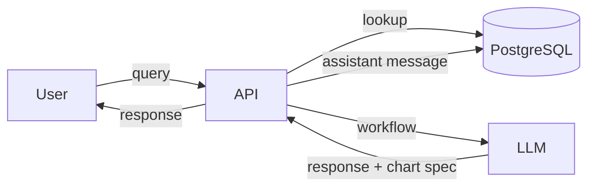
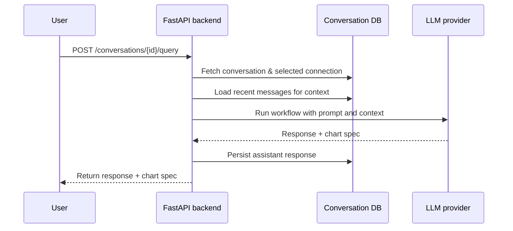
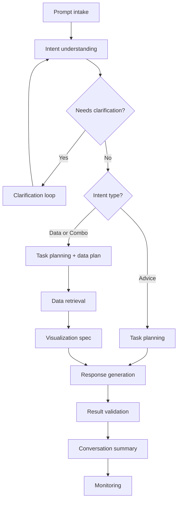
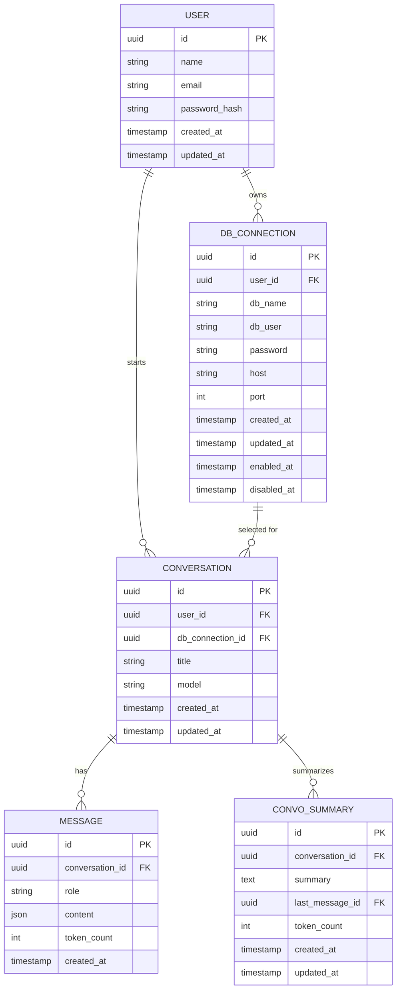

# llm-data-analyst

Full‑stack demo of an LLM‑powered data analysis assistant. The repository contains a
React + Vite front end and a FastAPI backend.

## Features

- User registration and login with JWT stored in HTTP‑only cookies
- Manage and enable/disable database connections
- Create conversations and retrieve full message history
- Toggleable sidebar for switching conversations and configuring connections
- Conversations are summarized after each assistant reply to keep context
  within token limits, and each summary records its last refresh time
- Inline error messages with cleared loading indicators for failed API calls
- Summarization failures are logged and warnings emitted after repeated errors

## Structure

- `client/` – React front-end (empty placeholder).
- `server/` – FastAPI application exposing the chatbot API.
  - `api/` – route declarations grouped by resource.
  - `schemas/` – Pydantic models for requests and responses.
  - `services/` – business logic and database access helpers.
  - `main.py` – creates the FastAPI app and wires the routes.

## Running the backend

The backend uses [uv](https://docs.astral.sh/uv/) for dependency management. Install
dependencies and start the server with:

```bash
cd server
uv sync
uv run uvicorn server.main:app --reload
```

Configuration values are loaded with `pydantic-settings` so you can define them in a `.env` file.

Environment variables:

- `LLM_API_KEY` – API key for the LLM provider
- `JWT_SECRET` – secret used to sign JWTs (`change-me` default)
- `JWT_EXP_SECONDS` – token lifetime in seconds (defaults to one day)
- `ENVIRONMENT` – set to `production` to enable secure cookie settings
- `LLM_RESPONSE_MODEL` – LLM model used for final summaries
- `DATABASE_URL` – connection string for the application's metadata DB
- `LOG_LEVEL` – logging level for the backend (default `INFO`)

## API overview

All routes are served under the `/api/v1` prefix and require a valid
JWT cookie unless noted.

### Users
- `POST /users` – register a new user
- `PUT /users/{id}` – update profile or password
- `POST /users/login` – authenticate and receive the JWT cookie
- `POST /users/logout` – clear authentication cookies

### Database connections
- `GET /db-connections` – list connections for the current user
- `POST /db-connections` – create a new connection
- `PUT /db-connections/{id}` – update a connection
- `POST /db-connections/{id}/enable` – enable a connection
- `POST /db-connections/{id}/disable` – disable a connection

### Conversations
- `GET /conversations` – list conversations for the current user
- `GET /conversations/{id}` – fetch a conversation with its messages
- `POST /conversations` – create a conversation bound to a DB connection
- `POST /conversations/{id}/query` – run the AI workflow and receive a response and chart spec

## Backend workflow

Each conversation stores the database connection it should use. When a user
sends a query, the API fetches the associated connection, gathers recent
messages for context, and runs a LangGraph-based workflow. The workflow may
query the database and call the LLM to produce a narrative response and chart
specification, which are saved as assistant messages. After each assistant
response, the conversation is summarized and stored so later requests only
need the summary plus the most recent messages.



### Detailed request flow



1. **Resolve connection** – the API looks up the conversation to find the
   bound database connection and recent messages.
2. **Run workflow** – the LangGraph workflow uses the prompt and context to
   analyze data and generate an assistant reply with a chart specification.
3. **Persist response** – the assistant output is stored as a message.
4. **Respond to user** – the API returns the response and chart spec to the client.

### AI workflow steps

The assistant adapts its path based on the user's intent. After any
clarification, requests branch into advice or data-driven flows.



Advice-only paths bypass data retrieval and visualization, generating a
direct narrative response from the user's prompt.

### Data model



## Running the frontend

```bash
cd client
npm install
npm run dev
```

The client expects the API at `http://localhost:8000`; override with
`VITE_API_BASE_URL` in a `.env` file if needed.

On first launch, register an account on the login page. After logging in, create a
database connection from the dropdown to start a conversation and run queries.
