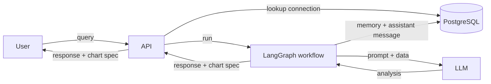
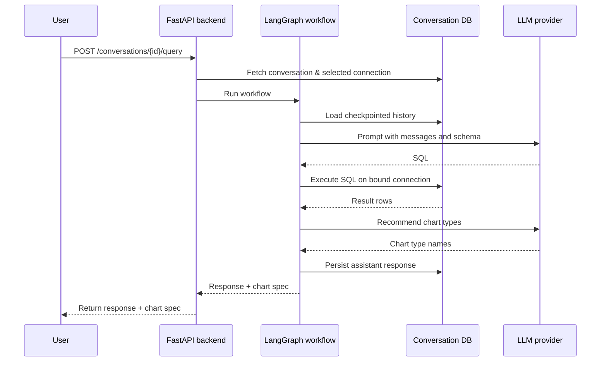
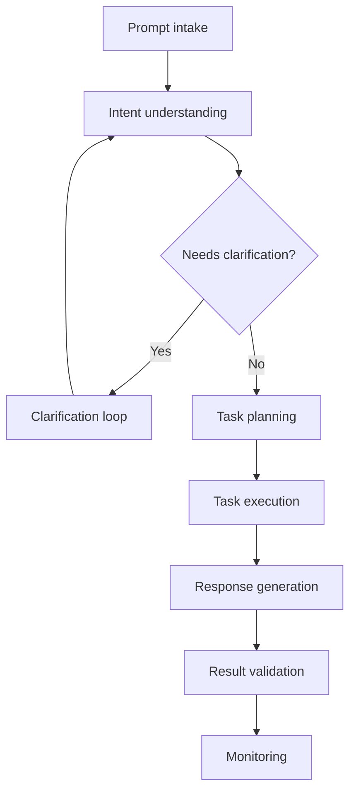
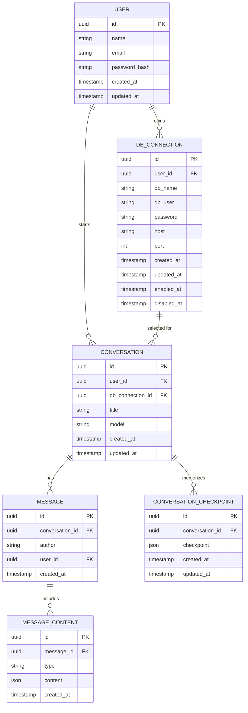

# llm-data-analyst

Full‑stack demo of an LLM‑powered data analysis assistant. The repository contains a
React + Vite front end and a FastAPI backend.

## Features

- User registration and login with JWT stored in HTTP‑only cookies
- Manage and enable/disable database connections
- Create conversations and retrieve full message history
- Toggleable sidebar for switching conversations and configuring connections, fetching conversations on mount
- <!-- Conversations are summarized after each assistant reply using an LLM to keep
  context within token limits, and each summary records its last refresh time -->
- Chat UI built with reusable layout and custom hooks for conversations and messages
- Conversation history is stored via a LangGraph checkpointer backed by
  PostgreSQL, which keeps the latest K messages and summarizes older ones
- Inline error messages with cleared loading indicators for failed API calls
- Guardrail checks validate generated SQL and responses, detecting PII or
  profanity and halting the workflow on violations
- Intent classification and entity extraction are handled by an LLM instead of keyword heuristics
- Clarifying questions are generated by the LLM when the user's request is ambiguous
- Task planning breaks complex prompts into ordered steps and chooses between data retrieval and text generation tools for each
- Chart recommendations are generated by an LLM from each task's description, returning only chart type names drawn from client-provided `available_charts`. Visualization specs include all chart types the LLM proposes
- Each workflow step is logged with LLM thoughts, generated SQL, and token counts and can be inspected via `GET /api/v1/step-logs/{message_id}`

## Structure

- `client/` – React front-end (empty placeholder).
- `server/` – FastAPI application exposing the chatbot API.
  - `api/` – route declarations grouped by resource.
  - `schemas/` – Pydantic models for requests and responses.
  - `services/` – business logic and database access helpers.
  - `workflows/` – LangGraph workflow; each step lives in `workflows/steps/` for readability.
  - `main.py` – creates the FastAPI app and wires the routes.

## Running the backend

The backend uses [uv](https://docs.astral.sh/uv/) for dependency management. Install
dependencies and start the server with:

```bash
cd server
uv sync
uv run uvicorn server.main:app --reload
```

Configuration values are loaded with `pydantic-settings` so you can define them in a `.env` file.

Environment variables:

- `LLM_API_KEY` – API key for the LLM provider
- `JWT_SECRET` – secret used to sign JWTs (`change-me` default)
- `JWT_EXP_SECONDS` – token lifetime in seconds (defaults to one day)
- `ENVIRONMENT` – set to `production` to enable secure cookie settings
- `LLM_RESPONSE_MODEL` – LLM model used for final summaries
- `CONVERSATION_MEMORY_K` – number of recent messages to keep verbatim in
  conversation memory
- `DATABASE_URL` – connection string for the application's metadata DB
- `LOG_LEVEL` – logging level for the backend (default `INFO`)

## API overview

All routes are served under the `/api/v1` prefix and require a valid
JWT cookie unless noted.

### Users
- `POST /users` – register a new user
- `PUT /users/{id}` – update profile or password
- `POST /users/login` – authenticate and receive the JWT cookie
- `POST /users/logout` – clear authentication cookies

### Database connections
- `GET /db-connections` – list connections for the current user
- `POST /db-connections` – create a new connection
- `PUT /db-connections/{id}` – update a connection
- `POST /db-connections/{id}/enable` – enable a connection
- `POST /db-connections/{id}/disable` – disable a connection

### Conversations
- `GET /conversations` – list conversations for the current user. Returns an array
  of objects with each conversation's `id` and optional `title`.
- `GET /conversations/{id}` – fetch a conversation with its messages
- `POST /conversations` – create a conversation bound to a DB connection
- `POST /conversations/{id}/query` – send a prompt and run the AI workflow. The
  response uses a standard envelope with `status`, `code`, and a `data.message`
  array of parts. Each part is validated using the `TextContent` or
  `DataContent` schema to ensure consistent `{ "type": "text", "content": str }`
  and `{ "type": "data", "content": ChartSpecification }` structures. If the
  workflow needs more details, follow-up questions are returned as text parts.

#### List conversations response

```json
[
  { "id": "uuid", "title": "optional" }
]
```

#### Response schema

```json
{
  "status": "ok",
  "code": 200,
  "data": {
    "message": [
      { "type": "text", "content": "Answer text or clarifying questions" },
      { "type": "data", "content": { } }
    ]
  }
}
```

Chart specifications returned in `data` parts follow this schema:

```json
{
  "title": "string",
  "xAxis": {
    "label": "string",
    "dataType": "category" | "date" | "numeric",
    "values": ["string" | number],
    "unit": "string (optional)"
  },
  "yAxis": [
    { "label": "string", "values": [number], "unit": "string (optional)" }
  ],
  "chartTypes": ["string"]
}
```

Multiple chart types may be listed so the client can render the option it prefers.

Clarifications are included as additional text parts. The API does not split
prompts containing multiple questions, so the front end should either prompt the
user for a single question or issue multiple calls.

## Backend workflow

Each conversation stores the database connection it should use. When a user
sends a query, the API fetches the associated connection and records the prompt.
The workflow's prompt intake step then loads the checkpointed summary and recent
messages via the LangGraph checkpointer before gathering them for context and
checking whether more details are needed. If so, it returns those questions in
the `response` before running any SQL. Otherwise it executes the LangGraph
workflow to produce an assistant `response` and `chart_spec`.
The resulting specification is saved as an assistant message. After each
assistant response, the conversation memory is updated via the checkpointer,
which retains a running summary and the most recent messages for future turns.



### Detailed request flow



1. **Resolve connection**  
   *Input:* conversation id  
   *Output:* database connection bound to the conversation.
2. **Generate query**
   *Input:* user prompt, checkpointed summary, recent messages, and schema
   *Output:* SQL statement.
3. **Execute SQL**  
   *Input:* SQL statement and database connection  
   *Output:* result rows.
4. **Build visualization**
   *Input:* result rows and chart options
   *Output:* chart specification and natural‑language summary saved as an assistant message.
5. **Validate outputs**  
   *Input:* generated SQL and summary  
   *Output:* sanitized response or guardrail violation.
6. **Respond to user**  
   *Input:* validated response and chart specification  
   *Output:* message returned to client.

### AI workflow steps

The assistant adapts its path based on the user's intent. If clarification is
needed, it routes follow-up questions through the response generation step.
Otherwise, requests branch into advice or data-driven flows. Intent and entity
recognition are powered by an LLM that extracts metrics, dimensions, and
timeframes from the user's prompt.



During **Task execution**, each planned step decides whether to retrieve data
or answer with text, ensuring complex prompts are handled linearly.

<!-- During the **Conversation summary** step, the workflow calls the conversation
service to generate and persist a running summary of the dialogue. The service
invokes an LLM to merge the previous summary with the latest messages. The
returned text and the id of the last processed message are stored in the
database and made available to downstream nodes via the workflow state. -->

Conversation memory is maintained by a LangGraph checkpointer. It keeps the most
recent **K** interactions verbatim and summarizes older messages, producing a
compact history that is fed back into the workflow on subsequent turns.

#### Workflow state

The workflow shares a mutable `WorkflowState` dictionary. Key fields and their
data types:

| Key | Type | Description |
| --- | --- | --- |
| `conversation_id` | string | Current conversation identifier |
| `message_id` | string | Message identifier for the current turn |
| `user_id` | string | ID of the authenticated user |
| `prompt` | string | Raw user input |
| `history` | string | Concatenated summary and recent messages |
| `intent` | string | Sentence describing the user's intent(s) |
| `entities` | object | Extracted metrics, dimensions, timeframe, etc. |
| `needs_clarification` | boolean | Whether follow-up questions are required |
| `clarification_questions` | array<string> | Questions to ask the user |
| `clarification_answers` | object | User responses to clarification questions |
| `clarification_attempts` | integer | Number of clarification rounds attempted |
| `clarification_limit` | integer | Maximum clarification attempts |
| `clarification_escalated` | boolean | Whether the limit was exceeded |
| `plan` | object | High-level plan flags (e.g., `use_db`) |
| `db_url` | string | Database connection string |
| `error` | string | Error message if a step fails |
| `response` | string | Final natural-language reply |
| `summary` | string | Running conversation summary |
| `messages` | array<object> | Recent conversation messages |
| `timeframe` | string | Default or extracted timeframe |
| `timezone` | string | Default timezone assumption |
| `currency` | string | Default currency assumption |
| `available_charts` | array<string> | Chart types the LLM may select for visualizations |
| `model_name` | string | LLM model used for generation |
| `thought` | array<object> | `{step, thought}` entries appended per node |
| `tokens_in` | integer | LLM input tokens (logged then cleared) |
| `tokens_out` | integer | LLM output tokens (logged then cleared) |
| `tasks` | array<object> | Each task `{description, requires_data, result, token_in, token_out, sql?, error}` |
| `current_task_index` | integer | Index of the task being executed (internal) |

#### Node inputs and outputs

Each node receives and returns a mutable `WorkflowState` dict. The table below
shows which keys are read and how the state is updated at every step.

| Step | Consumes | State changes (type & operation) |
| --- | --- | --- |
| **Prompt intake** | `conversation_id` (string), `prompt` (string) | `history` (string, set from checkpoint), `summary` (string, set), `messages` (array<object>, replace), `thought` (array<object>, append) |
| **Intent understanding** | `prompt` (string), `history` (string) | `intent` (string, set), `entities` (object, merge defaults & parsed), `clarification_questions` (array<string>, replace), `needs_clarification` (boolean, set), `tokens_in` / `tokens_out` (integer, set & logged), `thought` (array<object>, append) |
| **Clarification loop** | `clarification_questions` (array<string>), `clarification_answers` (object), `entities` (object), `needs_clarification` (boolean), `clarification_attempts` (integer) | `entities` (object, merge answers), `needs_clarification` (boolean, set/clear), `clarification_attempts` (integer, increment), `clarification_escalated` (boolean, set when limit hit), `thought` (array<object>, append) |
| **Task planning** | `prompt` (string), `intent` (string) | `tasks` (array<object>, replace with `{description, requires_data, result, token_in, token_out, sql, error}` defaults), `plan` (object, set), `tokens_in` / `tokens_out` (integer, set & logged), `thought` (array<object>, append) |
| **Task execution** | `tasks` (array<object>), `entities` (object), `db_url` (string) | each task updated with `result`, `token_in`, `token_out`, `sql`, `error`; `tokens_in` / `tokens_out` (integer, accumulate & logged), `error` (string, set), `thought` (array<object>, append) |
| **Data retrieval\*** | `db_url` (string), `entities` (object), `current_task_index` (integer), `tasks[current].description` (string), `available_charts` (array<string>) | `tasks[current].sql` (string, set), `tasks[current].result` (object, set to `{type: "data", content: chart_spec}`), `tasks[current].error` (string, set), `thought` (array<object>, append success/failure) |
| **Text generation\*** | `tasks` (array<object>), `current_task_index` (integer) | `tasks[current].result` (object, set to `{type: "text", content}`), `tasks[current].token_in` / `tasks[current].token_out` (integer, set), `thought` (array<object>, append) |
| **Response generation** | `tasks` (array<object>) | `response` (string, set), `tokens_in` / `tokens_out` (integer, set & logged), `thought` (array<object>, append) |
| **Result validation** | `tasks[].sql` (array<string>), `response` (string) | `error` (string, set/clear), `thought` (array<object>, append) |
| **Monitoring** | `error` (string), `metrics` (object) | logs/alerts (side effect), `thought` (array<object>, append) |

\*Sub-steps invoked by Task execution depending on whether a task requires
database access or only text generation.

### Step logs
- `GET /step-logs/{message_id}` – retrieve workflow step logs

### Data model



## Running the frontend

```bash
cd client
npm install
npm run dev
```

The client expects the API at `http://localhost:8000`; override with
`VITE_API_BASE_URL` in a `.env` file if needed.

On first launch, register an account on the login page. After logging in, create a
database connection from the dropdown to start a conversation and run queries.
